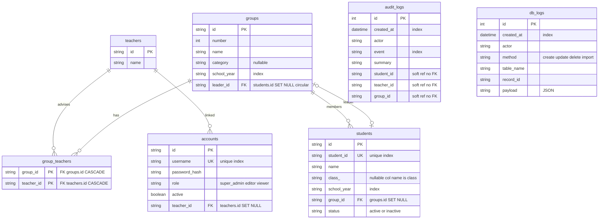

# 資料庫 ER Model

由 [`backend/app/models.py`](../backend/app/models.py) 整理。GitHub / VSCode（裝 Mermaid 外掛）可直接渲染。

## 關係摘要

| 關係 | 型態 | 刪除行為 |
|------|------|----------|
| Group ↔ Teacher | M:N（關聯表 `group_teachers`） | 兩端 CASCADE |
| Group → Student（members） | 1:N（`students.group_id`） | SET NULL |
| Group → Student（leader） | 1:1（`groups.leader_id`） | SET NULL，與 members 形成循環 FK，`use_alter` 破環 |
| Account → Teacher | N:1（`accounts.teacher_id`） | SET NULL |

## 備註

- `audit_logs` / `db_logs` 的 ref 欄位**刻意無 FK**：保留歷史，原資料刪除後紀錄仍在（無參照完整性）。
- `role` / `status` / `event` / `method` 等為**字串欄位、無 enum 約束**，由應用層把關。
- `students` ↔ `groups` 循環外鍵：SQLite dev 用 `use_alter` 自動建，Postgres 走 Alembic（`0001`）。
- Mermaid 不支援「同兩表間多條具名關係」並排顯示，members 與 leader 兩條 `groups–students` 已分行標註。
